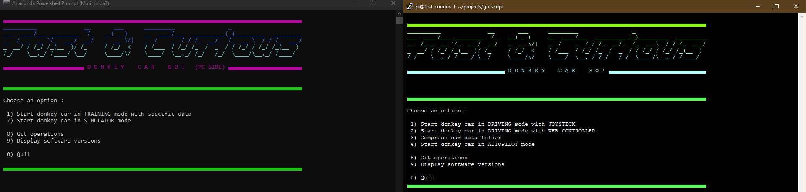
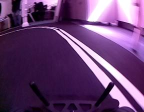
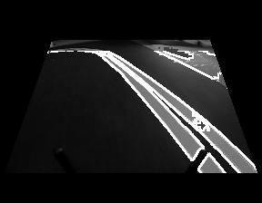
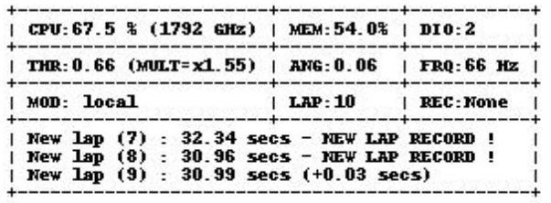

# Fast&Curious Edition Changelog

#### General
* Added a PC and Raspberry "Go Script" to simplify operations (start car, train, convert, compress data...)
  
* Bugfixes and versions updates in donkeycar installer (TF version)
* Bugfix on salient video creation (tensorflow 1 compatibility)
* Enabled default augmentations (blur and luminosity change)

#### Image and camera
* Changed default resolution to increase details
* Added image optimization processing (fc_transform_image part) :
  - Crop image
  - Remove high luminosity reflections
  - Change luminosity and contrast
  - Reverse image (optional)
  - Detect borders using specific thresholds

Original image : 

Optimized image : 
* Changed the tub writer part to save the original image (before optimization part) in a specific folder during recording
* Changed Pi white balance and camera mode to fixed values
* Modified the web controller part to display image transformations in real time
* Modified the web controller part to adjust image transformations threshold in realtime

#### Race and driving
* Enabled AI_Boost part to quickly start the car in race mode
* Added a race manager part (fc_race_manager) to handle :
  - Green light detection and start the race
  - Finish line detection and stop
  - Lap count and chronometer (best lap time...)
* Added a test mode on race manager to ajust detection thresholds in realtime
* Added a throttle control part (fc_throttle_control) to accelerate on specific conditions (straight direction, new lap...)
* Added a sensor management part, to handle distance sensors data. The sensors allow the car to steer or brake if a obstacle is nearby.
* Added a part (fc_openvino) for Intel Openvino support to handle model inference on Intel Neural Compute Stick 2

#### Informations
* Added a message bus to exchange status messages between fc parts
* Added an information part (fc_information) to display statistics in real time on the console or in the web controller
  - CPU usage and speed
  - Memory usage
  - Disk IOPS
  - Actual sterring / throttle
  - Actual loop frequency
  - Driving mode
  - Current lap
  - Last messages from message bus

Information : 

* Added sound support (fc_sound) to trigger sound effects on specific information coming on message bus
